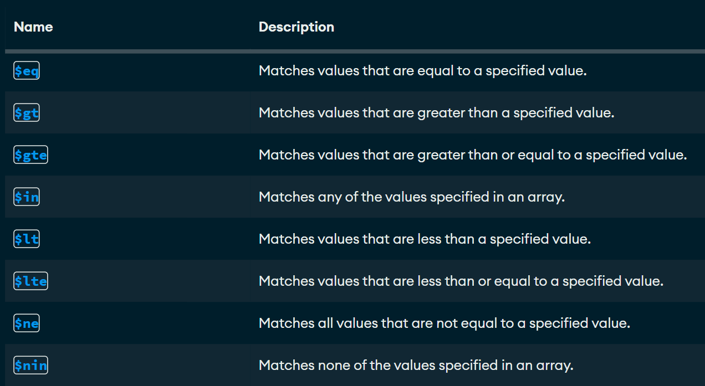
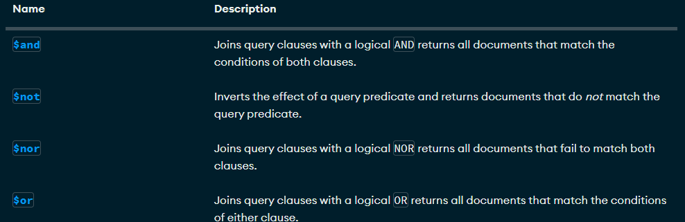

# Crud y consultas en MongoDb

## Crear una base de datos
Solo se crea si contiene por lo menos una colección

**use bd1**

## Como crear una colección
use bd1 
db.createCollection("Empleado")

## Como eliminar una base de datos
db.dropDatabase()

## Como insertar un solo documento
```json
db.alumnos.insertOne(
{
    nombre: 'Zoila',
    apellido1: 'Vaca',
    edad: 32,
    ciudad: 'San miguel de las piedras'
}
)
```

## Como insertar un solo documento con array
```json
db.alumnos.insertOne(
{
    nombre: 'Andrew',
    apellido: ' Garcia',
    apellido2: 'Granados',
    edad: 19,
    aficiones: [
        'Voleibol', 'Pokemon', 'Ingles'
        ]
}
)
```

## Inserción de documentos más complejos con documentos anidados y arrays
```json
db.alumnos.insertOne(
{
    nombre: 'David',
    apellido1: 'Montoya',
    apellido2: 'Rodriguez',
    edad: 21,
    estudios: [
        'Kinder Frida Khalo',
        'TSU en Desarrollo de Software'
            ],
    experiencia: {
                lenguajes: 'SQL',
                sbd: 'SQL Server',
                anios: 5
                }

}
)
```

## Como insertar multiplos documentos
```json
db.alumnos.insertMany(
[
    {
        _id: 12,
        nombre: 'Roberto',
        apellido: 'Gomez',
        edad: "23",
        descripcion: 'Es un comediante bueno'
    },
    {
        nombre: 'Luis',
        apellido: 'Suarez',
        edad: 43,
        habilidades: ['correr', 'dormir', 'morder'],
        direcciones: {
            calle: 'Del infierno',
            Numero: 666
        },
        esposas: [
            {
                nombre: 'Marisol',
                edad: 20,
                pension: 350,
                hijos: ['Joaquin', 'Bridget']
            },
            {
                nombre: 'Dorian',
                edad: 46,
                pension: 6500.56,
                complaciente: true
            }
        ]
    }
]
)
```

## Como mostrar una tabla
db.alumnos.find({})

## Como mostrar una tabla con where id
db.alumnos.find({_id:1})

## Mostrar las colecciones 
show collections

## Eliminar una colección
db.alumnos.drop() 

## Otros comandos
cls - clear
show dbs - muestra bases de datos


## practicas
```json
db.alumnos.insertOne(
{
    _id: 3,
    nombre: 'Sergio',
    apellido: 'Ramos',
    equipo: 'Monterrey',
    aficiones: ['Dinero', 'Hombres', 'Fiesta'],
    talentos: {
        futbol: true,
        bañarse: false
    }
}
)
```
## Cargar Datos
[Libros.json](./Data/libros.json)

## Búsquedas. Condiciones simples de igualdad. Método find()

1. Seleccionar todos los documentos de la colección libros
```json
db.libros.find({})
```

2. Mostrar todos los documentos que sean de la editorial biblio
```json
db.libros.find({editorial:'Biblio'})
```

3. Mostrar todos los docuemntos que el precio sea $25
```json
db.libros.find({precio:25})
```

4. Seleccionar todos los documentos donde el titulo sea json para todos
```json
db.libros.find({titulo:'JSON para todos'})
```

## Operadores de comparación

[Operadores de comparacion](https://www.mongodb.com/docs/manual/reference/operator/query/)



1. Mostrar todos los documentos donde el precio sea mayor a $25
```json
db.libros.find({
    precio:{$gt:25}})
```

2. Mostrar los documentos donde el precio sea 25 
```json
db.libros.find({
    precio:{$eq:25}})
```

3. Mostrar los documentos cuya cantidad sea menor a 5
```json
db.libros.find({
    cantidad:{$lt:5}})
```

4. Mostrar los documentos que pertenezcan a la editorial biblio o planeta
```json
db.libros.find({
    editorial:{$in:['Biblio','Planeta']}})
```

5. Mostrar todos los docuementos de libros que cuesten 20 0 25
```json
db.libros.find({
    precio:{$in:[20,25]}})
```

6. Mostrar todos los documentos de libros que no cuesten 20 o 25
```json
db.libros.find({
    precio:{$nin:[20,25]}})
```

7. Mostrar el primer documento de libros que cueste 20 o 25
```json
db.libros.findOne({
    precio:{$in:[20,25]}})
```

## Operadores Lógicos
[Operadores de lógicos](https://www.mongodb.com/docs/manual/reference/operator/query/)



### Operador AND

Dos posibles opciones de and

1. La simple: mediante condiciones separadas por comas.

***Sintaxis:***
```json
db.Coleccion.find({condicion1, condicion2}) 
```

Con esto asume que es una **AND**


2. Usando el operador $AND.

***Sintaxis:***

```json
db.Coleccion.find({$and:[{condicion1},{condicion2}]})
```

#### Ejercicios
1. Mostrar todos aquellos libros que cuesten más de 25 y cuya cantidad sea inferior a 15

***Forma simple***
```json
db.libros.find(
    {
        precio:{$gt:25},
        cantidad:{$lt:15}
    })
```

2. Mostrar todos aquellos libros que cuesten más de 25 y cuya cantidad sea inferior a 15 y id igual a 4
```json
db.libros.find(
    {
        precio:{$gt:25},
        cantidad:{$lt:15},
        _id:{$eq:4}
    })
```

***Forma con operador AND***
1. Mostrar todos aquellos libros que cuesten más de 25 y cuya cantidad sea inferior a 15
```json
db.libros.find({
    $and:[
        {precio:{$gt:25}},
        {cantidad:{$lt:15}}
    ]}
)
```

2. Mostrar todos aquellos libros que cuesten más de 25 y cuya cantidad sea inferior a 15 y id igual a 4
```json
db.libros.find({
    $and:[
        {precio:{$gt:25}},
        {cantidad:{$lt:15}},
        {_id:{$eq:4}}
    ]}
)
```


### Operador OR

***Sintaxis:***

```json
db.libros.find({$or:[{condicion1},{condicion2}]})
```


#### Ejercicios 

1. Mostrar todos aquellos libros que cuesten más de 25 o cuya cantidad sea inferior a 15 ####
```json
db.libros.find({$or:[{precio:{$gt:25}},{cantidad:{$lt:15}}]})
```

### AND y OR combinados

1. Mostrar los libros de la editorial biblio con precio mayor a 40 o libros de la editorial planeta con precio mayor a 30
```json
db.libros.find(
{
    $or: [
        {$and:[{editorial:'Biblio'}, {precio:{$gt:30}}]},
        {$and:[{editorial:{$eq:'Planeta'}}, {precio:{$gt:20}}]}
    ]
})
```

## Proyección de columnas

*** Sintaxis ***
```json
db.collection.find(filtro, columnas o proyecciones)
```

#### Ejemplos
```json
db.libros.find({}, {titulo:1})
```

1. Seleccionar todos los documentos, mostrando el titulo y la editorial
```json
db.libros.find({}, {_id:0, titulo:1, editorial:1})
```

2. Seleccionar todos los documentos de la editorial planeta mostrando solamente el titulo y la editorial
```json
db.libros.find(
    {editorial:{$eq:'Planeta'}}, 
    {_id:0, titulo:1, editorial:1}
)
```

[Empleados.json](./Data/empleados.json)
